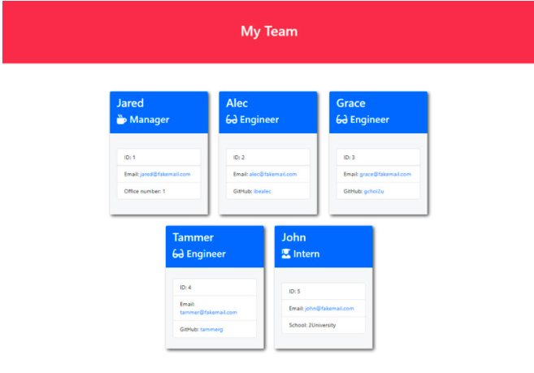

# team-generator
A Node.js command-line application that takes in information about employees on a software engineering team and generates an HTML webpage that displays summaries for each person.

## Technologies
* HTML
* CSS
* Node.js
* Jest testing framework

## Screenshot

    </img>

## GitHub Repo
https://github.com/snowden421/team-generator